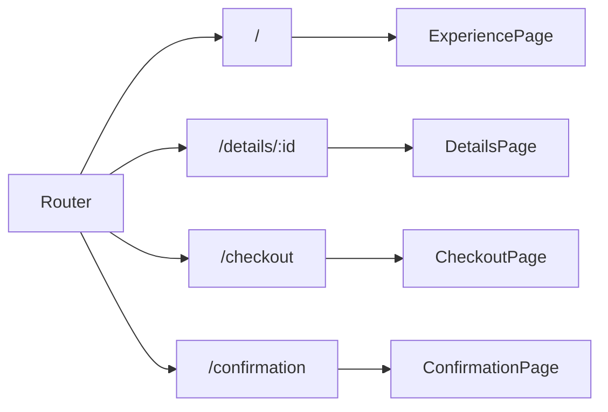
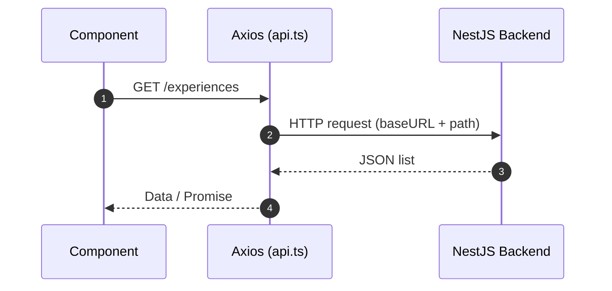
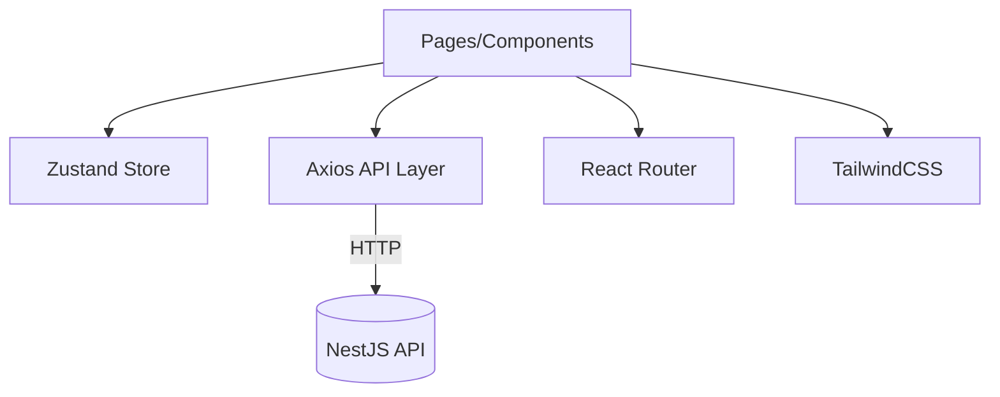
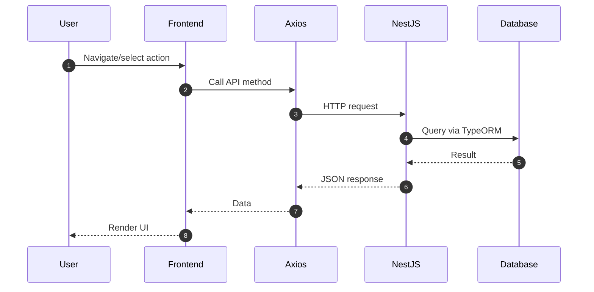

# Highway Delite Frontend (React + Vite)

## Table of Contents

- **Overview**
- **Tech Stack**
- **Project Structure**
- **Setup**
- **Scripts**
- **Environment**
- **Routing**
- **State Management**
- **API Layer**
- **Architecture**
- **Request Workflow**
- **UI/Styling**
- **Future Improvements**

## Overview

React frontend for Highway Delite. Lists experiences, shows details, handles checkout and confirmation. Integrates with the NestJS backend via Axios with a configurable base URL.

## Tech Stack

- **Framework**: React 19 + Vite
- **Routing**: React Router v6
- **State**: Zustand
- **HTTP**: Axios
- **Styling**: TailwindCSS v4, utility components
- **Icons/UX**: lucide-react, sonner

## Project Structure

```
frontend/
  src/
    App.tsx
    main.tsx
    assets/
    components/
      Layout.tsx
      Header.tsx
      ExperienceCard.tsx
      ui/
        button.tsx
        card.tsx
        checkbox.tsx
        input.tsx
        sonner.tsx
    data/
      dummy.ts
    lib/
      api.ts
      utils.ts
    pages/
      ExperiencePage.tsx
      DetailsPage.tsx
      CheckoutPage.tsx
      ConfirmationPage.tsx
    store/
      bookingStore.ts
```

## Setup

- Install dependencies
  ```bash
  pnpm install
  ```

- Run in development
  ```bash
  pnpm run dev
  ```

- Build and preview
  ```bash
  pnpm run build
  pnpm run preview
  ```

## Scripts

- `dev`: start Vite dev server
- `build`: type-check and build
- `preview`: preview production build
- `lint`: run ESLint

## Environment

- Create `.env` in `frontend/`:
  - `VITE_API_BASE_URL` (default fallback is `http://localhost:3000`)

## Routing

Routes are defined in `src/App.tsx`:

- `/` → `ExperiencePage`
- `/details/:id` → `DetailsPage`
- `/checkout` → `CheckoutPage`
- `/confirmation` → `ConfirmationPage`



## State Management

- `store/bookingStore.ts` manages selected experience/slot and booking data.
- Global, lightweight state using Zustand.

## API Layer

- `lib/api.ts` wraps Axios with base URL from `VITE_API_BASE_URL`.
- Interceptors log requests/responses and handle timeouts/network errors.



## Architecture



## Request Workflow



## UI/Styling

- TailwindCSS v4 utilities.
- UI primitives in `components/ui/*`.
- Icons via `lucide-react`; toasts via `sonner`.

## Future Improvements

- Add error boundaries and suspense patterns.
- Introduce react-query/tanstack-query for request caching.
- Form validation with react-hook-form and zod.
- E2E tests with Playwright or Cypress.
