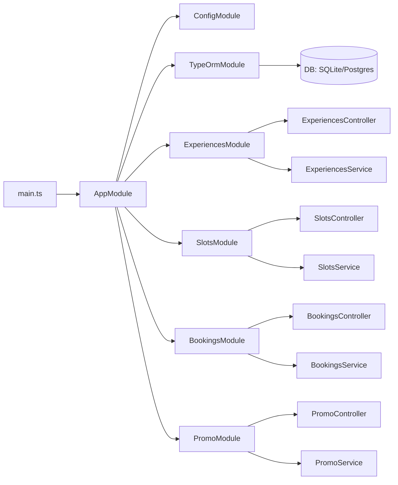
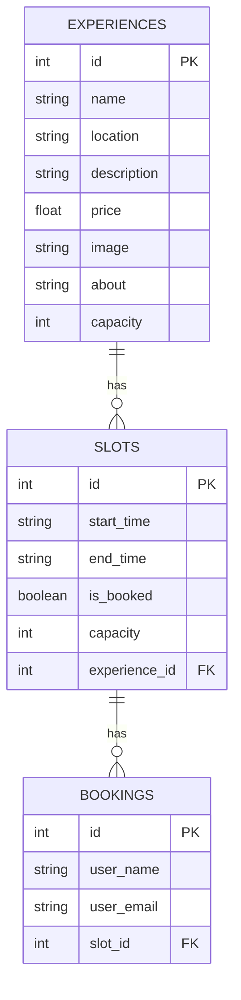
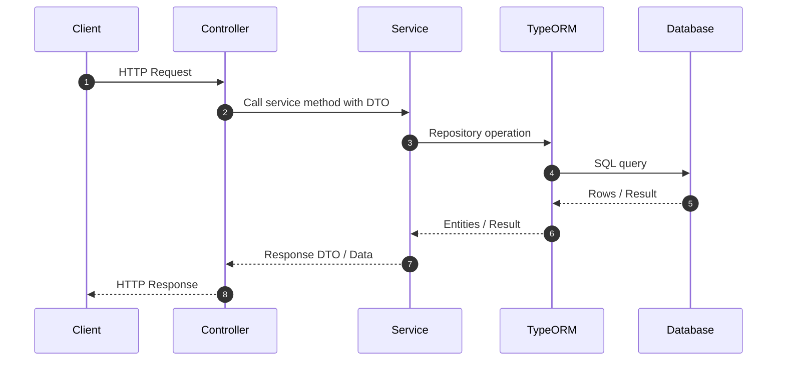

<p align="center">
  <a href="http://nestjs.com/" target="blank"></a>
</p>

[circleci-image]: https://img.shields.io/circleci/build/github/nestjs/nest/master?token=abc123def456
[circleci-url]: https://circleci.com/gh/nestjs/nest

  <p align="center">A progressive <a href="http://nodejs.org" target="_blank">Node.js</a> framework for building efficient and scalable server-side applications.</p>
    <p align="center">
<a href="https://www.npmjs.com/~nestjscore" target="_blank"></a>
<a href="https://www.npmjs.com/~nestjscore" target="_blank"></a>
<a href="https://www.npmjs.com/~nestjscore" target="_blank"></a>
<a href="https://circleci.com/gh/nestjs/nest" target="_blank"></a>
<a href="https://discord.gg/G7Qnnhy" target="_blank"></a>
<a href="https://opencollective.com/nest#backer" target="_blank"></a>
<a href="https://opencollective.com/nest#sponsor" target="_blank"></a>
  <a href="https://paypal.me/kamilmysliwiec" target="_blank"></a>
    <a href="https://opencollective.com/nest#sponsor"  target="_blank"></a>
  <a href="https://twitter.com/nestframework" target="_blank"></a>
</p>
  <!--[](https://opencollective.com/nest#backer)
  [](https://opencollective.com/nest#sponsor)-->

## Table of Contents

- **Overview**
- **Tech Stack**
- **Project Structure**
- **Setup**
- **Usage**
- **Configuration**
- **Startup & Seeding**
- **Logging**
- **API Endpoints**
- **Architecture**
- **Request Workflow**
- **Testing**
- **Future Improvements**

## Overview

NestJS backend for Highway Delite. Provides APIs for managing experiences, slots, bookings, and promo validation. Built with NestJS 11, TypeORM, and ConfigModule. Defaults to SQLite for local development and can switch to PostgreSQL via `DATABASE_URL`.

## Tech Stack

- **Runtime**: Node.js (TypeScript)
- **Framework**: NestJS 11
- **ORM**: TypeORM
- **Database**: SQLite (dev default) or PostgreSQL (via `DATABASE_URL`)
- **Config**: `@nestjs/config`
- **HTTP**: Platform Express

## Project Structure

```bash
backend/
  src/
    app.module.ts
    main.ts
    config/
      database.config.ts
    experiences/
      experiences.controller.ts
      experiences.module.ts
      experiences.service.ts
      dto/
        create-experience.dto.ts
        update-experience.dto.ts
      entities/
        experience.entity.ts
    slots/
      slots.controller.ts
      slots.module.ts
      slots.service.ts
      dto/
        create-slot.dto.ts
        update-slot.dto.ts
      entities/
        slot.entity.ts
    bookings/
      bookings.controller.ts
      bookings.module.ts
      bookings.service.ts
      dto/
        create-booking.dto.ts
      entities/
        booking.entity.ts
    promo/
      promo.controller.ts
      promo.module.ts
      promo.service.ts
      dto/
        validate-promo.dto.ts
    seed.ts
```

## Setup

- **Prerequisites**
  - Node.js 18+
  - pnpm

- **Install dependencies**
  ```bash
  pnpm install
  ```

- **Environment variables**
  Create `.env` in `backend/` (or use `.env.example` as reference):
  - `PORT` (optional, default 3000)
  - `DATABASE_URL` (optional; if set, Postgres is used; otherwise SQLite file `sql_app.db`)
  - CORS origin is set to `http://localhost:5173` in `main.ts` (update if needed)

## Usage

```bash
# development
pnpm run start:dev

# production build and run
pnpm run build && pnpm run start:prod

# one-off seed (if needed)
npx ts-node src/seed.ts
```

Base URL: `http://localhost:${PORT || 3000}`

## Configuration

- `ConfigModule.forRoot({ isGlobal: true })`
- `TypeOrmModule.forRootAsync` uses `getDbConfig` from `config/database.config.ts`:
  - If `DATABASE_URL` is present: Postgres
  - Otherwise: SQLite database file `sql_app.db`
- TypeORM settings:
  - `synchronize: true` (dev only)
  - `logging: process.env.TYPEORM_LOGGING === 'true'` (default off for clean console)

## Startup & Seeding

- **Auto table creation (dev)**
  - TypeORM `synchronize: true` creates tables from entities on startup in development.

- **Automatic data seeding**
  - `SeedingModule` + `DataSeederService` run on application bootstrap.
  - If tables are empty, it inserts:
    - 5 sample Experiences with public images (Unsplash links)
    - Related Slots based on provided schedules
    - Promo codes: `SAVE10` (10% percent) and `FLAT100` (flat 100)
  - After seeding, a summary is logged, e.g., `Seeding summary -> experiences: 5, slots: 9, promos: 2`.

- **Re-seeding**
  - Seeding is idempotent: only runs when counts are zero. Existing data is preserved.

- **Manual seed (optional)**
  - A legacy `src/seed.ts` script exists for one-off runs via `npx ts-node src/seed.ts`.

## Logging

- **Keep startup logs**
  - NestJS default logger is enabled; you will see app/module/route init logs.

- **Silence SQL logs**
  - TypeORM SQL logging is disabled by default.
  - To enable temporarily: set env `TYPEORM_LOGGING=true` before `pnpm run start:dev`.

## API Endpoints

- **Health**
  - `GET /` → returns hello string

- **Experiences** (`/experiences`)
  - `POST /experiences` → create experience
  - `GET /experiences` → list all
  - `GET /experiences/:id` → get by id
  - `PATCH /experiences/:id` → update by id
  - `DELETE /experiences/:id` → delete by id

- **Slots** (`/slots`)
  - `POST /slots` → create slot
  - `GET /slots` → list all
  - `GET /slots/:id` → get by id
  - `PATCH /slots/:id` → update by id
  - `DELETE /slots/:id` → delete by id

- **Bookings** (`/bookings`)
  - `POST /bookings` → create booking

- **Promo** (`/promo`)
  - `POST /promo/validate` → validate promo code

## API Docs (Swagger)

- Interactive docs available at: `GET /docs`
- Default local URL: `http://localhost:3000/docs`
- Generated with `@nestjs/swagger` using `SwaggerModule.setup('docs', app, document)` in `main.ts`.

## Architecture

- **Modules**: `ExperiencesModule`, `SlotsModule`, `BookingsModule`, `PromoModule`
- **Layers**: Controller → Service → Repository (TypeORM Entities)
- **Config**: Global `ConfigModule`, database config via `getDbConfig`



## SE Diagrams

### Entity Relationship Diagram (ERD)



### System Context

```mermaid
flowchart LR
  User((User)) --> FE[Frontend (React/Vite)]
  FE -->|HTTP/JSON| BE[NestJS Backend]
  BE -->|TypeORM| DB[(SQLite / PostgreSQL)]
```

### Deployment Diagram

```mermaid
flowchart TD
  subgraph Client
    Browser[Web Browser]
  end

  subgraph Hosting
    FE[Static Frontend (Vite build)]
    BE[NestJS App]
    DB[(SQLite file / Postgres instance)]
  end

  Browser --> FE
  FE -->|API calls| BE
  BE --> DB
```

## Request Workflow



## Testing

### Commands

```bash
# Run unit tests (fast)
pnpm run test

# Run e2e tests (spins a testing Nest app)
pnpm run test:e2e

# Run tests with coverage (generates text + HTML + lcov reports)
pnpm run test:cov
```

### What each does

- **test**: Executes all `*.spec.ts` unit tests in `src/`.
- **test:e2e**: Executes e2e tests under `test/` (uses its own Jest config).
- **test:cov**: Runs unit tests and collects coverage. Reports are written to `coverage/`.

### Coverage reports

- Text summary shown in terminal.
- HTML report: `backend/coverage/lcov-report/index.html`
- LCOV file: `backend/coverage/lcov.info`

### Coverage thresholds

Global minimum thresholds are enforced via Jest config in `package.json`:

```json
{
  "jest": {
    "coverageThreshold": {
      "global": {
        "statements": 45,
        "branches": 55,
        "functions": 40,
        "lines": 45
      }
    }
  }
}
```

### Coverage snapshot (recent)

```
All files  | 57.68% Statements | 66.42% Branches | 66.03% Functions | 57.63% Lines

Modules highlights
- bookings: ~81%+
- experiences: ~83%+
- promo: ~79%+
- slots: ~77%+ (service + controller tests added)
```

## Future Improvements

- Add DTO validation pipes and class-validator rules
- Replace `synchronize: true` with migrations for prod safety
- Add pagination and filtering for list endpoints
- Introduce Swagger (`@nestjs/swagger`) for live API docs
- Implement authentication/authorization if needed
- Configure CORS via env and per-environment settings
- Add request logging and structured logger